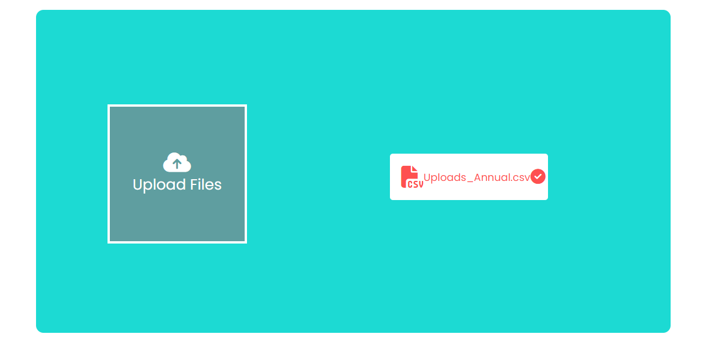
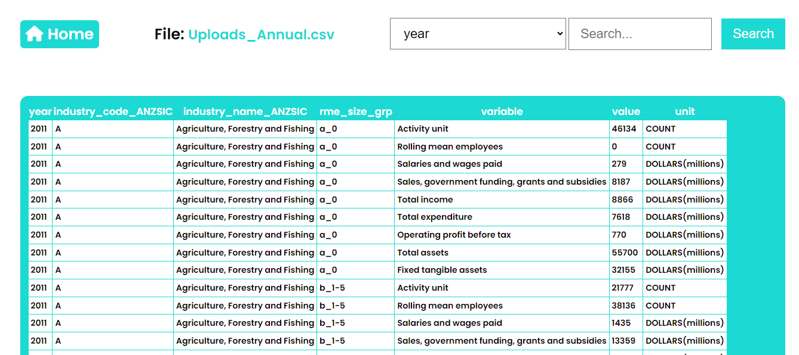

# CSV-Uploder
Through this application you can view your csv file on web.

A basic CSV Uploder. Tech Stack : HTML, CSS, JS, Node.js

### Home :



### Habit :



## Technology Stack
- EJS
- SCSS
- NodeJS
- Express
- Mongodb

## How-To-Use

- Clone this project
- Start by installing npm and mongoDB if you don't have them already.
- Run the Mongo Server.
- Navigate to Project Directory
    ```
    cd CSV-Uploder
    ```
- run following commands :
    ```
    npm install 
    ```
    ```
    npm start
    ```

   
## Directory Structure and flow of The Code
This code follows MVC pattern and hence everything is differentiated and well managed:

    csv_Uploder
        |   .gitignore
        |   app.js
        |   package-lock.json
        |   package.json
        |   Readme.md
        |
        +---assets
        |   +---css
        |   |       filePage.css
        |   |       uploadPage.css
        |   |
        |   +---images
        |   \---js
        |           filePage.js
        |           uploadPage.js
        |
        +---config
        |       config.js
        |
        +---controllers
        |       csvControllers.js
        |
        +---models
        |       csvModel.js
        |
        +---routes
        |       routes.js
        |
        +---uploads
        |       5dd775cd03e90d0b3545a82ce703bfff
        |       9a9a0b7008f9897c88e182a19fbc0553
        |       af0518608d3fc97a4f2a09541296078f
        |
        \---views
                filePage.ejs
                uploadPage.ejs


Happy Coding :)